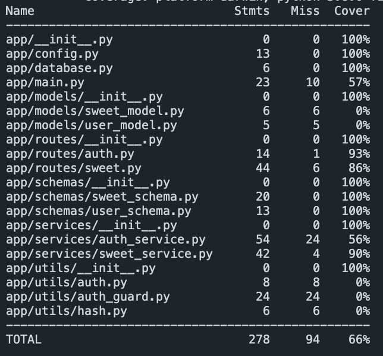

#  Sweet Shop

A full-stack **Sweet Shop Management System** with a **FastAPI backend** and a **React frontend**. This project features user authentication, role-based access control, sweet inventory management, cart functionality, and a responsive, modern UI.

---

##  Table of Contents

- [ Features](#-features)
- [ Technologies](#-technologies)
- [ Quick Start](#-quick-start)
 -[ Backend Setup](#-backend-setup)
 -[ Frontend Setup](#-frontend-setup)
- [ Project Structure](#-project-structure)
- [ Default Admin Account](#️-default-admin-account)
- [ License](#-license)

---

## Features

-  JWT-based authentication with role-based access (User/Admin)
-  Admin CRUD operations for sweets (add, update, delete, restock)
-  Users can browse sweets, search by name/category, and manage a cart
-  Responsive UI with TailwindCSS and toast notifications
-  Secure API calls with Axios and JWT token interception
-  Protected frontend routes based on login status and user role

---

##  Technologies

###  Backend
- **FastAPI**
- **MongoDB**
- **Pydantic**
- **JWT**

###  Frontend
- **React**
- **React Router v6**
- **Axios**
- **TailwindCSS**
- **React Toastify**

###  Tooling
- **Vite**
- **PostCSS**
- **ESLint**

---

##  Quick Start

###  Backend Setup

#### 1. Clone the repository and navigate to the backend folder:
```bash
git clone <repository-url>
cd sweetshop/backend
```

#### 2. Create and activate a virtual environment:
```bash
# Windows
python -m venv venv
venv\Scripts\activate

# macOS/Linux
python3 -m venv venv
source venv/bin/activate
```

#### 3. Install dependencies:
```bash
pip install -r requirements.txt
```

#### 4. Create a `.env` file:
```env
MONGODB_URL=mongodb://localhost:27017
DATABASE_NAME=sweetshop
JWT_SECRET_KEY=your-secret-key
JWT_ALGORITHM=HS256
ADMIN_SECRET=YourAdminSecretHere
```

#### 5. Run the backend server:
```bash
uvicorn app.main:app --reload
```

**API available at:** http://localhost:8000

 **API Documentation:**
- **Swagger:** http://localhost:8000/docs
- **ReDoc:** http://localhost:8000/redoc

###  Frontend Setup

#### 1. Navigate to the frontend folder:
```bash
cd sweetshop/frontend
```

#### 2. Install dependencies:
```bash
npm install
```

#### 3. Create a `.env` file:
```env
VITE_API_BASE_URL=http://localhost:8000/api
```

#### 4. Start the frontend development server:
```bash
npm run dev
```

✅ **Frontend available at:** http://localhost:5173

---

## 📁 Project Structure

```
sweetshop/
├── backend/
│   ├── app/
│   ├── tests/
│   ├── requirements.txt
│   ├── .env
│   └── README_BACKEND.md
├── frontend/
│   ├── src/
│   ├── public/
│   ├── package.json
│   ├── postcss.config.cjs
│   ├── tailwind.config.js
│   ├── .env
│   └── README_FRONTEND.md
└── README.md
```

---

##  Default Admin Account

Upon backend startup, a default admin user is created:

- **Email:** `admin@sweetshop.com`
- **Password:** `AdminSecret123`


> **Note:** You can change the default password via the `ADMIN_SECRET` in your `.env` file.

#TestCoverage#  Sweet Shop

A full-stack **Sweet Shop Management System** with a **FastAPI backend** and a **React frontend**. This project features user authentication, role-based access control, sweet inventory management, cart functionality, and a responsive, modern UI.

---

##  Table of Contents

- [ Features](#-features)
- [ Technologies](#-technologies)
- [ Quick Start](#-quick-start)
 -[ Backend Setup](#-backend-setup)
 -[ Frontend Setup](#-frontend-setup)
- [ Project Structure](#-project-structure)
- [ Default Admin Account](#️-default-admin-account)
- [ License](#-license)

---

## Features

-  JWT-based authentication with role-based access (User/Admin)
-  Admin CRUD operations for sweets (add, update, delete, restock)
-  Users can browse sweets, search by name/category, and manage a cart
-  Responsive UI with TailwindCSS and toast notifications
-  Secure API calls with Axios and JWT token interception
-  Protected frontend routes based on login status and user role

---

##  Technologies

###  Backend
- **FastAPI**
- **MongoDB**
- **Pydantic**
- **JWT**

###  Frontend
- **React**
- **React Router v6**
- **Axios**
- **TailwindCSS**
- **React Toastify**

###  Tooling
- **Vite**
- **PostCSS**
- **ESLint**

---

##  Quick Start

###  Backend Setup

#### 1. Clone the repository and navigate to the backend folder:
```bash
git clone <repository-url>
cd sweetshop/backend
```

#### 2. Create and activate a virtual environment:
```bash
# Windows
python -m venv venv
venv\Scripts\activate

# macOS/Linux
python3 -m venv venv
source venv/bin/activate
```

#### 3. Install dependencies:
```bash
pip install -r requirements.txt
```

#### 4. Create a `.env` file:
```env
MONGODB_URL=mongodb://localhost:27017
DATABASE_NAME=sweetshop
JWT_SECRET_KEY=your-secret-key
JWT_ALGORITHM=HS256
ADMIN_SECRET=YourAdminSecretHere
```

#### 5. Run the backend server:
```bash
uvicorn app.main:app --reload
```

**API available at:** http://localhost:8000

 **API Documentation:**
- **Swagger:** http://localhost:8000/docs
- **ReDoc:** http://localhost:8000/redoc

###  Frontend Setup

#### 1. Navigate to the frontend folder:
```bash
cd sweetshop/frontend
```

#### 2. Install dependencies:
```bash
npm install
```

#### 3. Create a `.env` file:
```env
VITE_API_BASE_URL=http://localhost:8000/api
```

#### 4. Start the frontend development server:
```bash
npm run dev
```

✅ **Frontend available at:** http://localhost:5173

---

## 📁 Project Structure

```
sweetshop/
├── backend/
│   ├── app/
│   ├── tests/
│   ├── requirements.txt
│   ├── .env
│   └── README_BACKEND.md
├── frontend/
│   ├── src/
│   ├── public/
│   ├── package.json
│   ├── postcss.config.cjs
│   ├── tailwind.config.js
│   ├── .env
│   └── README_FRONTEND.md
└── README.md
```

---

##  Default Admin Account

Upon backend startup, a default admin user is created:

- **Email:** `admin@sweetshop.com`
- **Password:** `AdminSecret123`


> **Note:** You can change the default password via the `ADMIN_SECRET` in your `.env` file.

#TestCoverage




