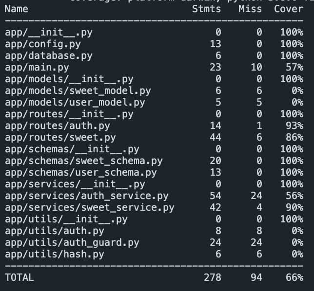

# Sweet Shop API

A FastAPI-based REST API for managing a sweet shop inventory with user authentication and role-based access control.

## Features

- **User Authentication**: JWT-based login/registration system
- **Role-based Access**: Admin and user roles with different permissions
- **Sweet Management**: CRUD operations for sweet inventory
- **Search & Filter**: Search sweets by name, category, and price range
- **Inventory Control**: Stock management and restocking functionality

## Quick Start

### Prerequisites

- Python 3.8+
- MongoDB (local or cloud instance)

### Installation

1. Clone the repository:
```bash
git clone <repository-url>
cd sweetshop
```

2. Install dependencies:
```bash
pip install -r requirements.txt
```

3. Set up environment variables:
```bash
# Create .env file with:
MONGODB_URL=mongodb://localhost:27017
DATABASE_NAME=sweetshop
JWT_SECRET_KEY=your-secret-key
JWT_ALGORITHM=HS256
ADMIN_SECRET=YourAdminSecretHere
```

4. Run the application:
```bash
uvicorn app.main:app --reload
```

The API will be available at `http://localhost:8000`

## Documentation

- **[API Documentation](docs/API_DOCUMENTATION.md)** - Complete endpoint reference
- **[Developer Guide](docs/DEVELOPER_GUIDE.md)** - Architecture and development setup
- **[Test Documentation](docs/TEST_DOCUMENTATION.md)** - Testing guide and patterns
- **Interactive Docs**: [Swagger UI](http://localhost:8000/docs) | [ReDoc](http://localhost:8000/redoc)

## Testing

```bash
pytest                    # Run all tests
pytest --cov=app         # Run with coverage
pytest tests/test_auth.py # Run specific tests
```

### Test Coverage

Current test coverage: **53.6%** (149/278 lines covered)

| Package | Coverage |
|---------|----------|
| schemas | 100% |
| config/database | 100% |
| services | 51% |
| routes | 60% |
| models | 0% |




Generate detailed coverage report:
```bash
pytest --cov=app --cov-report=html
open htmlcov/index.html
```

## Project Structure

```
sweetshop/
├── app/
│   ├── constants/          # Application constants
│   ├── models/            # Data models
│   ├── routes/            # API endpoints
│   ├── schemas/           # Pydantic schemas
│   ├── services/          # Business logic
│   ├── utils/             # Utility functions
│   ├── config.py          # Configuration settings
│   ├── database.py        # Database connection
│   └── main.py           # Application entry point
├── tests/                 # Test files
├── requirements.txt       # Dependencies
└── README.md             # This file
```

## Default Admin Account

On startup, an admin account is automatically created:
- **Email**: admin@example.com
- **Password**: AdminSecret123
